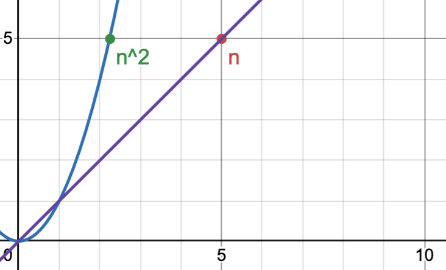

Literally **THE MOST** important thing in doing Leetcodes is: **MAKING SURE YOU UNDERSTOOD THE TASK**. I spent so much time thinking about non-existing problems, just because I misread or misunderstood something. For many of you English is not the first language. I know you know English well tho. I also understand English well. But understanding English and perfectly understanding the algorithmic task you are to implement, can someone mean two different things. Go slowly, it's just you and the task. You got it.

## Learning problems

Problems I want to describe in-depth, so that they will serve as examples for all the other ones. 

#### 9. Palindrome Number (Easy)

```python
class Solution(object):
    def isPalindrome(self, x):
        """
        :type x: int
        :rtype: bool
        """
        if x < 0:
            return False

        # naive approach
        # we reverse the whole number and compare to the original
        # reversing is done, by cutting off the last digit of the
        # input, we do that in a loop:
        # 1. cut last number by modulo
        # 2. add it to the reverse, multiplying previous by 10,
        #    cause each new digit is a new decimal place
        # 3. complete division by 10 on original number, to cut
        #    the digit
        reverse = 0
        temp = x

        while temp != 0:
            digit = temp % 10
            reverse = reverse * 10 + digit
            temp = temp // 10

        return reverse == x

    def isPalindrome2(self, x):
        if x < 0 or (x != 0 and x % 10 == 0):
            return False

        # optimal approach
        # reverse only the last half of the numbers, and compare
        # with the first half, skip the middle number if exists
        # we terminate the while if reverse is bigger than reverse
        # it takes a minute to be mentally sure its a good condition
        # but it is, and thinking about it is easier than writing it
        # down shortly
        # we need to add additional return for not even numbers, cause
        # above termination mechanism will eat the middle number

        reverse = 0
        original = x

        while x > reverse:
            reverse = reverse * 10 + x % 10
            x = x // 10

        return x == reverse or x == (reverse // 10) # second is for not even
```

---

#### 53. Maximum Subarray (Medium)

**Rewritten instruction**: Find the maximum sum of consecutive elements of the array.

##### Solution(s)

The first, obvious and with zero intuition, approach is to just double loop over the array elements. This works, but it's not good. Wanna guess the time complexity? You're right: $O(n^2)$.

**Why? Quicky on double loop time complexity:**

For each of the outer loops iteration $i$, we get $n-i$ inner loop iterations. Therefore the total of all iterations is:

$$S = (n-1) + (n-2) + (n-3) +...+1$$

Back to primary school: how to calculate the sum of arithmetic progressions? In general the arithmetic progression is something that starts at some $a_0$, has constant additive element $d$, and is bounded by the number of elements $n$ (it turns into arithmetic series when the number of elements is not bounded: $n \to \infty$). 

**Derivation of the arithmetic progression sum formula:**

We will an example of the progression in a normal form, and reversed. 

$$S_f = 1 + 2 + ... + (n-1) + n$$

$$S_r = n + (n-1) + ... + 2 + 1$$

Now eyeball it. First term on both, second term on both... 

$$S_f + S_r = (n+1) + (n+1) + (n+1)... = 2S$$

Yeaaah, it's all coming together. How many terms is there: $n$. Each term is: $n+1$. So it's all just:

$$2S = n(n+1)$$

$$S = \frac{n(n + 1)}{2}$$

Now, being absolutely sure, we understand how many iteration we have down to atomic level, we can get back to how we come up with complexity $O(n^2)$.

We calculate the big-O complexity, by finding the dominating factor as $n$ grows towards infinity. If you ever calculated series sums. It's the same principle. You look for whatever term that outgrows others by orders of magnitude as $n$ grows. In this case, when we multiply the upper term:

$$S = \frac{n^2+n}{2}$$

Quadratic function grows faster than the linear one. Graphical way to understand why $n^2$ dominates for bigger $n$. You'd literally have to take something like $n=\frac{1}{3}$, for n to be bigger. 



Now, we can finally see the naive and bad solution, understanding why it's naive and bad. 

```python
def maxSubArray(self, nums):
    """
    :type nums: List[int]
    :rtype: int
    """
    top = float("-inf")
    acc = 0
    n = len(nums)

    for i in range(n):
        acc = nums[i]
        if acc > top:
            top = acc
        for j in range(i+1, n):
            acc += nums[j]
            if acc > top:
                top = acc
    return top
```

How can we make it better? In general we know, that less than zero elements are bad, but we can't just remove them all. Sometimes they can be in the middle of good elements, and together make a maximum subarray.

Is there a way to make it smart? Turns out there it, we can simply cut the leading less than zero elements. Whenever our carried sum is below 0, we can be sure that it can be safely dropped, and either we hope that already found max is the real max, or the leftover elements will yield the real max. A good intuition on that: https://www.youtube.com/watch?v=5WZl3MMT0Eg where neetcode compares it to a sliding window — makes it nicer to understand.

```python
def maxSubArray(self, nums):
    # we get non-empty array, so we know max
    # has to be at least not smaller than the
    # first element
    maxSub = nums[0]
    currSum = 0

    # we make a single pass through the array
    for n in nums:
        # if our carried sum is smaller than 0
        # we dont need it, its not gonna do any
        # good to the leftover sums
        if currSum < 0:
            currSum = 0
        currSum += n
        maxSub = max(currSum, maxSub)
    
    return maxSub
```

This is quite beautiful. This approach is called Kadane's algorithm and it's time complexity is $O(n)$, since we make just a single pass over the elements.

#### 27. Remove Element

So what do they mean by remove in-place? You may remember that certain operations in python can be done in place, that is, they will not return a new object that you need to assign to variable, instead they change the object you perform the operation on and it's kept under the same variable name. Probably the best Python example is the two ways to sort:

```python 
arr = [1, 3, 2]

# not in-place
# you need to assign new memory for a new variable
arrSorted = sorted(arr)

# in-place
# you operate on the same object in memory 
arr.sort()
```

So we are asked not to create a new array, for which we only append elements different than `val`. The usual way to do it is to move all elements not meeting the condition to the end of the array, and keeping track of the number of values meeting the condition. We can then return the array, and number of values meeting the condition. This way we cut off all the values we don't want. Imagine we don't want any 5s in our array:

```python
arr = [5, 2, 4, 1, 5, 6, 5]

remove5s(arr) # -> [2, 4, 1, 6, 5, 5, 5], 4
```

So the plan for this exercise is to just iterate over the examples, keeping track of current numbers meeting the condition, and swapping these numbers so that they occupy leading positions in the array:

```python
def removeElement(self, nums, val):
    n = len(nums)
    k = 0

    for i in range(n):
        if nums[i] != val:
            nums[k] = nums[i]
            k += 1
    return k
```

We can't really do a better job. We are not taking any new memory, and the time complexity is just $O(n)$, as we only iterate once.

---

#### 217. Contains Duplicate

The brute force approach is to iterate with two for loops, and just compare all the numbers with each other. But we already know this is not a good solution. We also know it's time complexity thanks to the problem 53., we have nested for loops, so it's $O(n^2)$. 

```python
def containsDuplicate(self, nums):
    for num1 in nums:
        for num2 in nums:
            if num1 == num2:
                return True
    return False
```

So what can we do to make it better? One approach is to first sort the array (ie. with quicksort with time complexity $n\log n$) and then iterating just once, comparing subsequent elements. The total time complexity for this would be $O(n\log n + n)=O(n\log n)$ Remember? We talked in 53. that only the dominant terms matter in big O notation, that's why we only got the $n\log n$ part in final time complexity. 

##### Quicksort tangent

Learning how quicksort works is a typical journey in understanding any algorithm — you have to eyeball it, play with it, and magically it clicks. In general you pick the last element, sort the array in regard to this element so that it's placed in a correct spot, having smaller values to the left and greater values to the right. Then you recursively do that with the values on the left and values on the right, skipping the one element you placed correctly in the first function call. A good, slow animation is here: https://www.youtube.com/watch?v=Vtckgz38QHs&t=318s. 

Example of quicksort implementation is in `quicksort.py`. Tried on 100 random arrays of length 100, with ints between 0, and 100 it yields an average of 647.01 operations. Which is in the ballpark of expected $O(n \log n)$ as it would yield $700$ operations. Reminder that for worst case scenario, when the partitions quicksort creates while sorting, are heavily unbalanced, the complexity can grow up to $O(n^2)$.  

As we set to really make an example of these learning problems, we have to show the $O(n\log n)$ time complexity of quicksort. 


